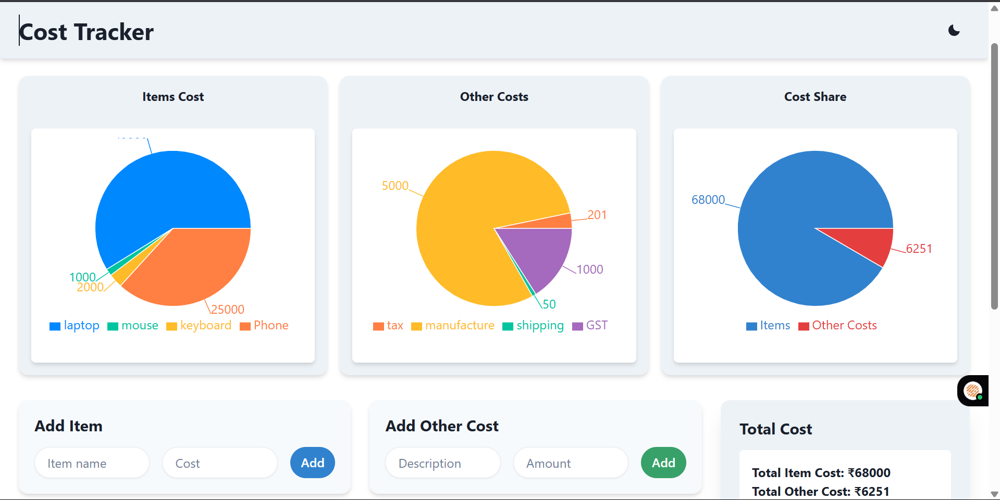

# 💸 Cost Tracker App

A modern, responsive cost tracking web application that helps users monitor their expenses efficiently through interactive charts and a clean UI.

## 🚀 Features

- 📊 **Visual Expense Tracking**: Dynamic pie charts for:
  - Item vs. Other Costs
  - Category-wise Cost Breakdown
  - Monthly Spending Trends
- 🔐 **Authentication**:
  - Email/password login
  - Google Sign-in (JWT based with cookie storage)
- 🛠️ **Real-time Data**:
  - Firebase Firestore integration for secure, cloud-based cost storage
  - Realtime fetching and aggregation of user-specific costs
- 🎨 **Beautiful UI**:
  - Chakra UI for accessible and responsive design
  - Custom theme toggle (light/dark mode)
- 🌐 **Redux State Management**:
  - Global user authentication state handling
- ⚙️ **Firebase Setup**:
  - Firestore collections: `/users/{uid}/items`, `/users/{uid}/otherCosts`
  - Secure user-based data access

---
## 📷 Preview



---

## 🧱 Tech Stack

| Tech         | Description                              |
|--------------|------------------------------------------|
| React        | Frontend UI Framework                    |
| Chakra UI    | Component Library & Styling              |
| Firebase     | Authentication & Firestore Database      |
| Redux        | State Management                         |
| Recharts     | Data Visualization (Pie/Bar/Line Charts) |

---

## 📁 Folder Structure

```bash
src/
│
├── components/
│ ├── CostChart.jsx # Pie chart for Items vs Other Costs
│ ├── CategoryChart.jsx # Pie chart for cost categories (coming)
│ ├── MonthlyChart.jsx # Bar/line chart for monthly trends (coming)
│
├── pages/
│ ├── Dashboard.jsx # Main dashboard with charts
│ └── Login.jsx # Login page
│
├── redux/
│ ├── authSlice.js # Redux slice for auth state
│ └── store.js # Redux store setup
│
├── firebase.js # Firebase config and initialization
└── App.jsx # Main app entry

```

---

## 🧑‍💻 Getting Started

### 1. Clone the repository

```bash
git clone https://github.com/your-username/cost-tracker.git
cd cost-tracker
```

###2. Install dependencies

```bash
npm install
```
